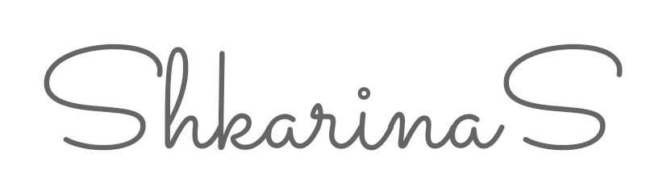

  
   
  
 

 

Personal portfolio

 

## Preview

  

## Main Features & Architectural Notes
- :hammer_and_wrench: Built with **Next.js** framework
- :paintbrush: Prototyped and designed in **Adobe XD**
- :art: Responsive design styled with **Sass** 

## License
Licensed under the MIT License.
